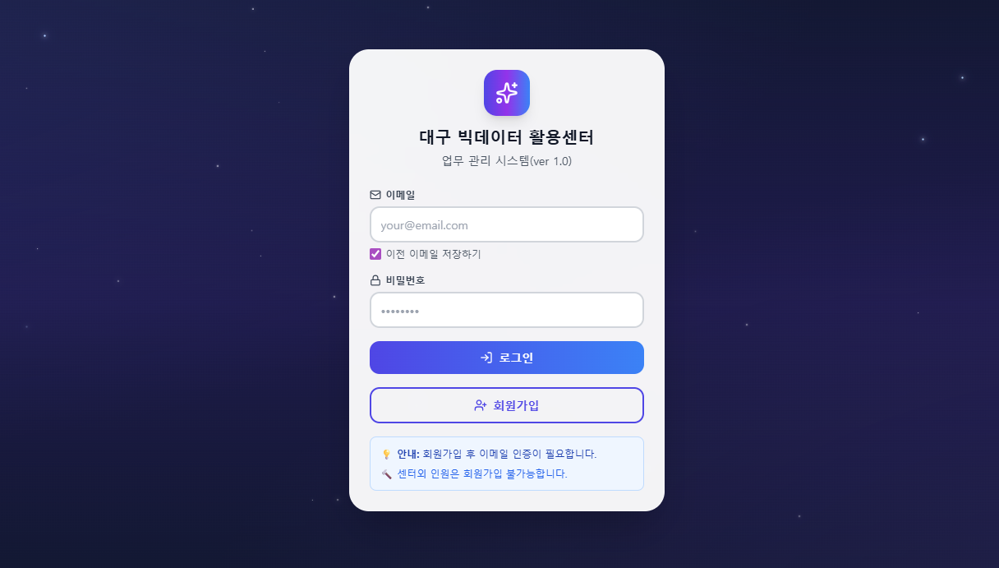

# 대구 빅데이터 활용센터 업무 관리 시스템

업무 가시성 확보 및 신속한 병목 해결을 위한 웹 기반 직원 업무 관리 시스템입니다.

, 세부내용은 공개 불가


## 🎯 프로젝트 목적

- **업무 가시성 확보**: 담당자별 사업의 진행 현황을 한눈에 파악
- **신속한 병목 해결**: 직관적인 신호등(Traffic Light) UI를 통해 지연 업무를 즉시 식별
- **피드백 루프 단축**: 시스템 내 원클릭 피드백 기능을 통해 실시간 소통 강화

## 🛠️ 기술 스택

- **Frontend**: React 19.2.0, Vite 7.2.4, TypeScript 5.9.3
- **Styling**: Tailwind CSS, shadcn/ui
- **상태 관리**: Zustand, TanStack Query
- **Backend**: Supabase (인증, PostgreSQL, Realtime)

## 📦 빠른 시작

### 1. 의존성 설치

```bash
npm install
```

### 2. 환경 변수 설정

`.env.example` 파일을 참고하여 `.env` 파일을 생성하고 Supabase 정보를 입력합니다:

```env
VITE_SUPABASE_URL=your_supabase_project_url
VITE_SUPABASE_ANON_KEY=your_supabase_anon_key
```


### 3. 개발 서버 실행

```bash
npm run dev
```

개발 서버는 `http://localhost:5173`에서 실행됩니다.

### 4. 빌드

```bash
npm run build
```

## 🔑 주요 기능

### 관리자 모드
- 전체 직원 업무 현황 대시보드
- 프로젝트 유형별 및 상태별 필터링
- 개별 업무에 대한 피드백 작성 및 전송
- 직원 관리 및 최신 댓글 조회
- 통계 및 현황 페이지

### 사용자 모드
- 본인 할당 업무 조회 (Kanban 보드)
- 업무 상태(진행/지연/완료) 및 진도율 업데이트
- 관리자 피드백 수신 및 확인
- 최신 피드백 조회 (사이드바)
- 업무 생성, 수정, 삭제

### 신호등 시스템
- 🟢 **초록색**: 정상 진행 (여유 있음)
- 🟡 **노란색**: 주의 필요 (마감일이 가까움)
- 🔴 **빨간색**: 지연 또는 긴급 (마감일 임박 또는 지연)

## 📁 프로젝트 구조

```
src/
├── components/          # React 컴포넌트
│   ├── admin/          # 관리자 전용 컴포넌트
│   ├── user/           # 사용자 전용 컴포넌트
│   ├── layout/         # 레이아웃 컴포넌트
│   └── common/         # 공통 컴포넌트
├── pages/              # 페이지 컴포넌트
├── hooks/              # Custom React Hooks
├── stores/             # Zustand 스토어
├── types/              # TypeScript 타입 정의
└── lib/                # 유틸리티 및 설정
```

## 🗄️ 데이터베이스

Supabase PostgreSQL을 사용하며, 다음 주요 테이블이 있습니다:

- `user_profiles` - 사용자 정보
- `tasks` - 업무 정보
- `feedbacks` - 피드백 정보
- `comments` - 댓글 정보
- `comment_likes` - 댓글 좋아요

데이터베이스 스키마는 `supabase/migrations/` 디렉토리에 있습니다.

## 🔒 보안

- Supabase 인증을 통한 사용자 관리
- Row Level Security (RLS)를 통한 데이터 접근 제어
- 환경 변수를 통한 민감한 정보 관리
- `.env` 파일은 Git에 커밋되지 않도록 `.gitignore`에 포함됨

## 📱 반응형 디자인

- **데스크톱**: 전체 레이아웃 (기본)
- **태블릿/모바일**: 사이드바 오버레이 드로어, 반응형 카드 레이아웃

## 📄 라이선스

이 프로젝트는 대구 빅데이터 활용센터 내부용입니다.

## 📝 버전

**ver 1.0** - 초기 릴리스
